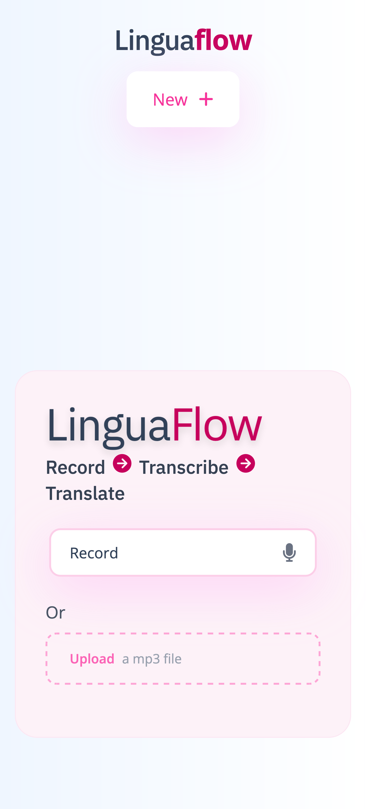
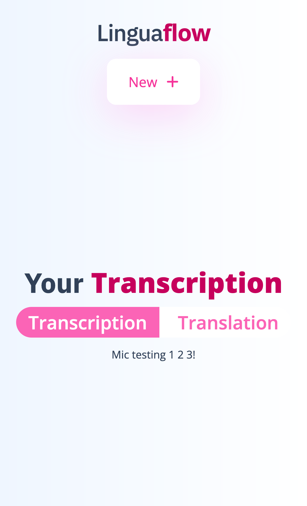

# LinguaFlow

🚧 **This project is currently under active development. Features and UI may change.** 🚧

LinguaFlow is a web app that lets you **convert voice messages or audio files into text and translate that text into any language you want**.  
You can upload an audio file (or record your voice directly in English), get an instant transcription, and then translate the result to your chosen language—all in your browser.

---




## ✨ Features

- **Record or Upload Audio:** Record your voice (in English) or upload an audio file (`.mp3`, `.wav`).
- **Transcription:** Automatically transcribes your audio to text.
- **Translation:** Instantly translate the transcribed text into any language.
- **Responsive Design:** Works great on mobile, tablet, and desktop.
- **Modern UI:** Built with React.js and styled using Tailwind CSS.

---

## 🚀 Tech Stack

- [React.js](https://react.dev/)
- [Tailwind CSS](https://tailwindcss.com/)

*More technologies will be added as the project evolves.*

---

## 🛠️ Installation

1. **Clone the repository:**
   ```sh
   git clone https://github.com/your-username/linguaflow.git
   cd linguaflow
   ```

2. **Install dependencies:**
   ```sh
   npm install
   # or
   yarn install
   ```

3. **Start the development server:**
   ```sh
   npm run dev
   # or
   yarn dev
   ```

4. **Open your browser:**  
   Visit [http://localhost:5173](http://localhost:5173) (or the port shown in your terminal).

---

## 📋 Usage

- Click **Record** to capture your voice, or **Upload** to select an audio file.
- Wait for the transcription to appear.
- Choose your target language and translate the text instantly.

---

## 🤝 Contributing

Pull requests are welcome! For major changes, please open an issue first to discuss what you would like to change.

---


## 📄 License

No license. All rights

---

## 🙏 Acknowledgements

- [React](https://react.dev/)
- [Tailwind CSS](https://tailwindcss.com/)
- [Font Awesome](https://fontawesome.com/)
- [Vite](https://vitejs.dev/)

---


Made with ❤️ by Piyush Kochar